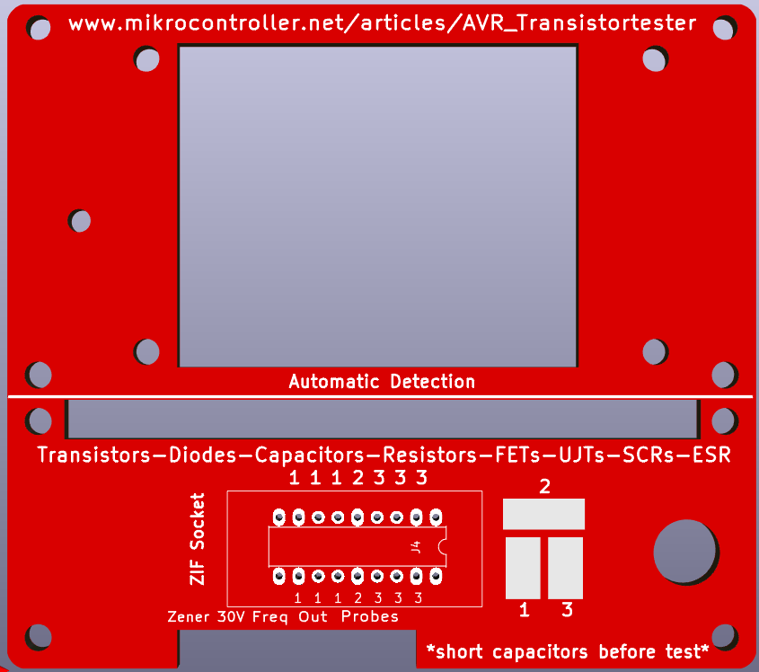
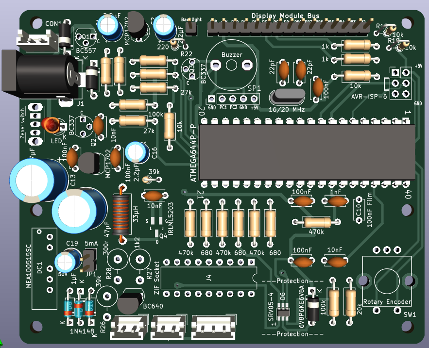

# Open-Source-Transistor-Tester
Hardware based the design at  Transistortester-Warehouse
https://github.com/madires/Transistortester-Warehouse/tree/master
The main pcb and the top covers are fixed togther using m3 brass hex spacers 14mm, 20mm and 35mm high

    

    

