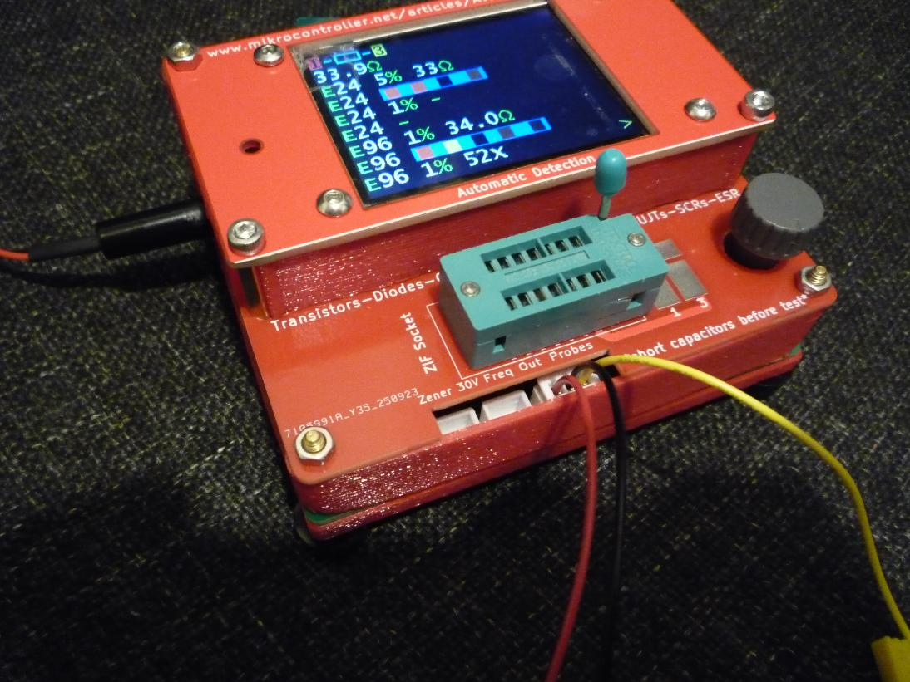
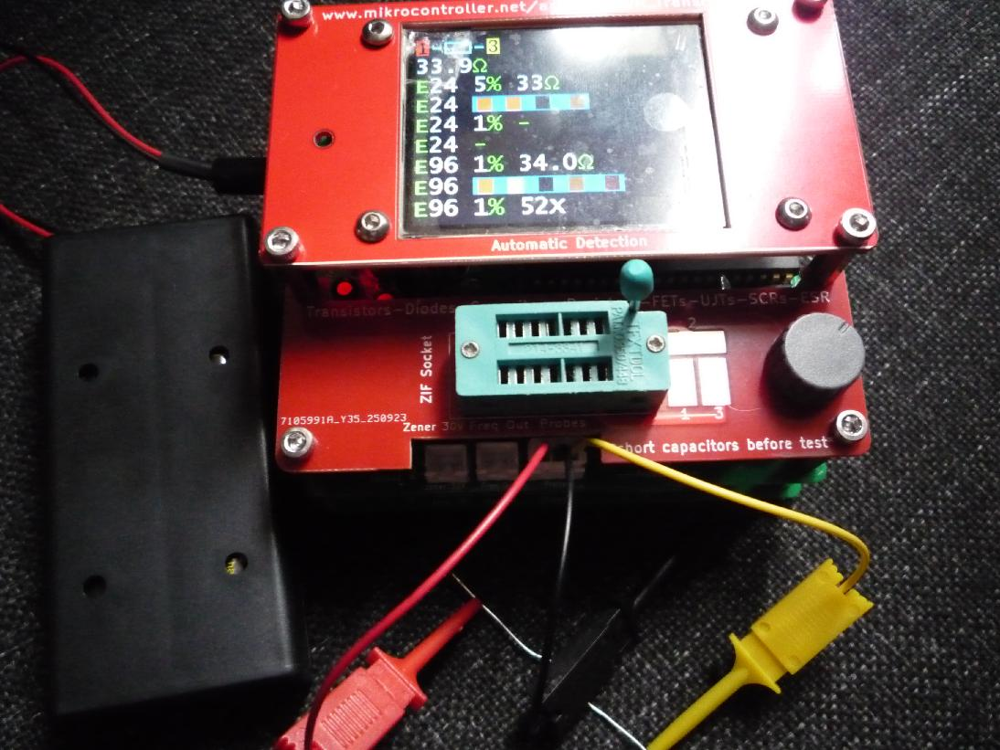

# Open-Source-Transistor-Tester
# Hardware based on the design at  Transistortester-Warehouse
https://github.com/madires/Transistortester-Warehouse/tree/master
# The main pcb and the top covers are fixed together using 8x m3 brass hex spacers 14mm high

    

    

 a functional tester can be built without the 3d printed parts if needed.

    
 

    

    

There is space for a slide switch on the side to isolate the 30v zener circuit to save battery when not in use.

